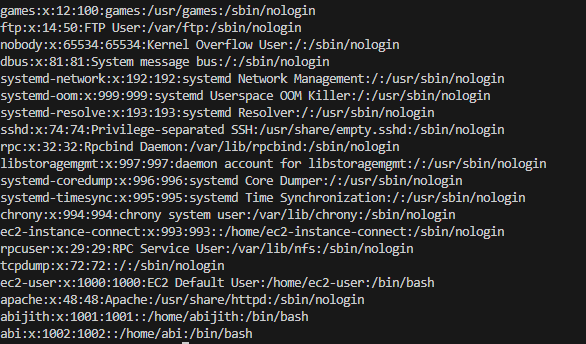

# LINUX

### Introduction to Linux

History and Evolution of Linux
Open Source Philosophy and GPL
Linux Distributions (Ubuntu, CentOS, RHEL, etc.)
Installation of Linux OS
Linux Desktop Environments (GNOME, KDE, XFCE)

### Basic Linux Commands

File and Directory Management (ls, cd, mkdir, rm, mv, cp, etc.)
File Viewing and Manipulation (cat, more, less, head, tail, nano, vim, etc.)
File Permissions and Ownership (chmod, chown, chgrp)
File Searching (find, locate, grep)
Viewing System Information (uname, uptime, df, du, free)

### Linux Filesystem

Filesystem Hierarchy Standard (FHS)
Understanding Root Directory and Subdirectories
Partitioning and Mounting Drives (mount, umount, df, blkid, lsblk)
Disk Management (fdisk, parted, mkfs, fsck)
Swap Space Configuration

### User Management

User and Group Management (adduser, useradd, passwd, usermod, groupadd)
Switching Users (su, sudo)
Managing User Permissions and Groups
Configuring Login and Access Control (/etc/passwd, /etc/shadow, /etc/group)

### Process and Task Management

Understanding Processes (ps, top, htop, pidof, pgrep)
Process Priority Management (nice, renice, kill, pkill)
Scheduling Tasks (cron, at, systemd timers)
Background and Foreground Tasks (&, fg, bg, jobs)

### Networking in Linux

Basics of Networking (ping, ifconfig, ip, netstat, ss)
Configuring Network Interfaces
Using SSH for Remote Access (ssh, scp, sftp)
Managing Hosts and DNS (/etc/hosts, /etc/resolv.conf)
Configuring Firewalls (iptables, firewalld)

### Package Management

Package Management Tools (apt, yum, dnf, zypper)
Installing, Updating, and Removing Software
Using Repositories
Compiling Software from Source

### Shell Scripting

Basics of Shell Scripting
Variables, Loops, and Conditional Statements
Creating and Running Scripts
Automation with Shell Scripts
Understanding Shebang (#!)

### System Administration

Boot Process and GRUB Configuration
System Logs and Log Management (journalctl, /var/log/)
Monitoring System Performance (vmstat, iostat, sar)
Backup and Restore (rsync, tar, dd)

### Security and Permissions

Understanding Linux File Permissions
Firewall Configuration (ufw, iptables)
Securing SSH
System Hardening Techniques
Understanding SELinux and AppArmor

User management in Linux:

#### useradd : - add new user

    useradd <username>
    ex:
        useradd abi

#### Set password for user

    passwd <username>
    ex:
        passwd abi

#### user configuration file - this file contains the information about  user format

    1.  This file will be avilable on  /etc/passwd
    2.  username : x : user id : user group id : : /home/username : /bin/bash    ----- This is the format of the passwd file
    

### Switch user 

    <b> Synatx :<\b>
        su <username>

    Ex: su abijith

### change the user id:
    syntax
    usermod  -u <new_id> <username>

    U- Represent uid (userid)

### change the user group 

    usermod -g <new group id> <username>

    ex: usermod -g 1001 abi    - so the user group will replce with this value 

### Remove user

    sudo userdel -r <username>

 
