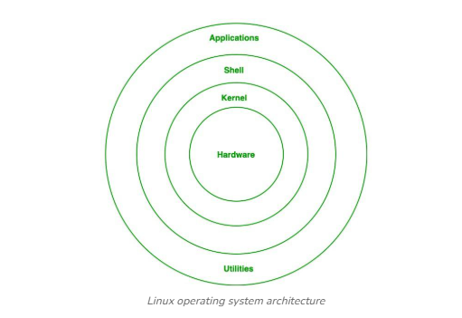

# LINUX

## 1. Kernel:
Kernel is the main core component if Linux, it controls the activity of other hardware components. It visualizes the common hardware resources and provide each process with necessary virtual resources. It makes the process to wait in the ready queue and execute in consequently to avoid any kind of conflict.

## 2. System Library:
System libraries are some predefined functions by using which any application programs or system utilities can access kernel’s features. These libraries are the foundation upon which any software can be built.

## 3. Shell:
Shell can be determined as the interface to the kernel, which hides the internal execution of functions of kernel from the user. Users can just enter the commend and using the kernel’s function that specific task is performed accordingly.

## 4. Hardware Layer:
Hardware layer of Linux is the lowest level of operating system track. It is plays a vital role in managing all the hardware components. It includes device drivers, kernel functions, memory management, CPU control, and I/O operations. This layer generalizes hard complexity, by providing an interface for software by assuring proper functionality of all the components.

## 5. System utility:
System utilities are the commend line tools that preforms various tasks provided by user to make system management and administration better. These utilities enables user to perform different tasks, such as file management, system monitoring, network configuration, user management etc.

